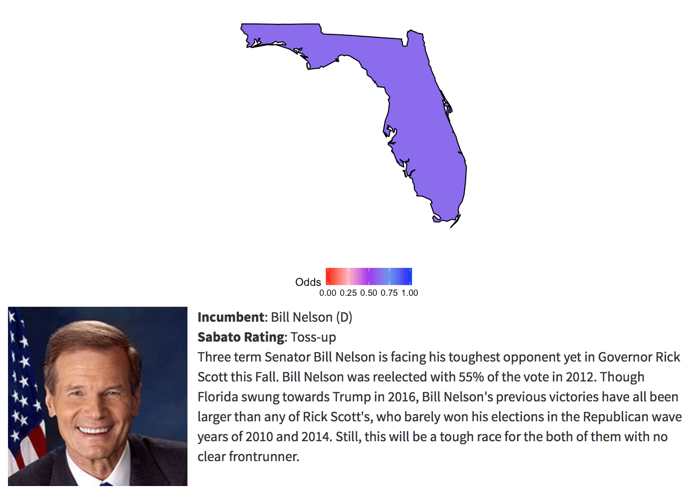

```{r setup, include=FALSE}
knitr::opts_chunk$set(echo = TRUE)
require(httr)
require(jsonlite)
require(dplyr)
require(fiftystater)
require(ggplot2)
```
## Packages used
The packages I used for this project are as follows:

* httr: To do HTTP GET requests for downloading real time data.
* jsonlite: To parse said HTTP GET requests which return their data in JSON format.
* dplyr: To clean data for use.
* fiftystater: To display maps of all fifty states. Most R U.S. map packages don't include Alaska or Hawaii, and I needed Hawaii for this project, so I used this package.
* ggplot2: For creating maps and displays of data.

## Introduction
Since Summer 2015, politics has permeated the minds of many moreso than it has in a long, long time. Donald Trump's shocking victory in 2016 left Democrats scrambling to retain any sort of power they had. In November 2018, the midterm elections will be happening, which is the first opportunity the country will have to give a referendum on Trump's presidency. If Donald Trump and the Republicans manage to hold on to the House and Senate, they will likely be emboldened and continue their attempts to repeal the Affordable Care Act and enact their other legislative priorities. If not, it could spell trouble for President Trump and his agenda.


This project attemps to analyze what people believe about what will happen during the midterm elections utilizing real time data from a political gambling website called PredictIt. This website functions essentially as a stock market for politics, where an event is framed as a contract, and people can buy 'yes' or 'no' shares on that contract. For example, one contract might be "Will Joe Biden win the Democratic nomination for the Presidency in 2020?" and people can sell shares of 'yes' or 'no' for whatever price they'd like between $1.00 and $0.01. In some ways, this gives a true reflection of what people's beliefs are about what's going to happen in this country, rather than just pundits giving their uninformed opinions, as on PredictIt, people are actually putting their money where their mouths are.

Specifically, I give an analysis of the U.S. House election using real time data from Real Clear Politics with their General Congressional Ballot polling data. Unfortunately, there are too many races to cover each one individually. Next, I give an analysis of each Senate race. Finally, I give an analysis on what people are thinking about for the 2020 election. 

Hopefully this project can serve as a way to keep up with the ever changing political landscape of this country.

## Importing Data: General Congressional Ballot
The first analysis I did was on U.S. house races. There are unfortunately too many House races (435) to give a detailed analysis of each, though PredictIt does have markets for many of the closer races. Because of this, I grabbed real time data of the General Congressional Ballot average from Real Clear Politics. This is done in the 'gcb.R' script, though it is copied here for convenience:

```{r}
require(httr)
require(jsonlite)
# Make HTTP GET request, transform data into JSON, and then to R dataframe.
gcb_request <- GET("https://www.realclearpolitics.com/epolls/json/6185_historical.js?1453388629140&callback=return_json")
gcb_str <- substring(content(gcb_request, 'text', encoding = 'UTF-8'), 
                     13, nchar(content(gcb_request, 'text', encoding = 'UTF-8'))-2)
gcb_dirty <- as.data.frame(fromJSON(gcb_str)$poll$rcp_avg)
gcb_clean <- data.frame()

# Clean data a little
for (i in 1:nrow(gcb_dirty)) {
  date_str <- substring(toString(gcb_dirty$date[[i]]),6,nchar(toString(gcb_dirty$date[[i]]))-15)
  date <- as.Date(strptime(date_str, format="%d %b %Y"))
  dem_val <- c(as.double(gcb_dirty$candidate[[i]]$value[1]))
  rep_val <- c(as.double(gcb_dirty$candidate[[i]]$value[2]))
  spread <- c(dem_val - rep_val)
  gcb_organized <- data.frame(Date=date, Democrat_Value=dem_val, 
                              Republican_Value=rep_val, Spread=spread)
  
  gcb_clean <- rbind(gcb_clean, gcb_organized)
}

gcb <- gcb_clean

```

## House Race Analysis


Currently, the House of Representatives has 235 Republican members, 193 Democratic members, and 7 vacant seats. A majority is needed to elect the speaker of the House, who controls what legislation gets to the floor. In order for Democrats to get a majority of seats in the next House of Representatives, they will need gain a net of 25 seats to reach 218 seats.

```{r}
ggplot(gcb[1:90,], aes(as.Date(Date), group=1)) +                    
      geom_line(aes(y=Democrat_Value), colour="blue") +  
      geom_line(aes(y=Republican_Value), colour="red") + 
      theme_classic() + 
      theme(plot.title = element_text(hjust = 0.5)) +
      labs(title="General Congressional Ballot: Last 90 Days", x = "Date", y = "Percent")
```

Democrats have a clear lead in the General Congressional Ballot. The most recent average from Real Clear Politics shows Democrats with a lead of 6.3.

Unfortunately, such a lead may not be enough for them - gerrymandering in house districts has made the path to a house majority quite difficult for Democrats. That said, it's far from impossible. Experts agree (whatever that means) that Democrats will need a lead in the popular vote of approximately 6-8 percent.

## Importing Data: Senate Races
The next analysis I did was on U.S. Senate races in the 2018 midterm. To do this, I needed to get data from PredictIt on each senate race. This is done in the 'senate.R' script, though it is copied here for convenience:

```{r}
# Make HTTP GET request, transform data into JSON, and then to R dataframe.
senate_request <- GET("https://www.predictit.org/api/marketdata/group/54", 
                      add_headers(Accept = "application/json"))
senate_str <- content(senate_request, 'text', encoding = 'UTF-8')
senate_markets <- as.data.frame(fromJSON(senate_str)$Market)
senate_contracts <- data.frame()
for (i in 1:nrow(senate_markets)) {
  contract <- as.data.frame(senate_markets[i,]$Contracts)
  contract$Market <- senate_markets[i,]$Name
  senate_contracts <- rbind(senate_contracts, contract)
}

# PredictIt gives us a lot of different markets that don't matter - we only care about a few
marketIDs = c(4332,5313,5264,5368,5369,5563,5564,
              7266,7267,7270,7271,7287,7288,7308,7309,
              7332,7635,8173,8314,8455,9906,9907,9908,9733)
states = c("all", "massachusetts", "texas", "vermont", "west virginia", "indiana", 
           "florida", "north dakota", "montana", "missouri", "wisconsin", "michigan", 
           "ohio", "new jersey", "new mexico", "maine", "nevada", "tennessee", "arizona", 
           "california", "mississippi", "nebraska", "pennsylvania", "minnesota")
senate_unsort <- senate_contracts %>% filter(ID %in% marketIDs)
senate_unsort$State <- states

# Some of the data gets returned in a strange way and must be cleaned.
senate_clean <- senate_unsort %>% select(Image, Name, BestSellYesCost, State)
senate_clean[1,]$Name <- "Will Republicans control the Senate after 2018?"
senate_clean[18,]$Name <- "Will the Democratic party win the Tennessee U.S. Senate election in 2018?"
senate_clean[19,]$Name <- "Will the Democratic party win the Arizona U.S. Senate election in 2018?"
senate_clean[21,]$Name <-"Will the Republican party win the Mississippi U.S. Senate special election in 2018?"

# Certain races that are uncompetitive are left out, so I've added them here to have a complete list
leftout_images <- c("https://pbs.twimg.com/profile_images/871076844904361985/7NorOQHB_400x400.jpg",
                    "https://pbs.twimg.com/profile_images/378800000497501114/77d2bd85a246e66e8f77670018fbaaca_400x400.jpeg",
                    "https://pbs.twimg.com/profile_images/943313772785164288/svG7qRs8_400x400.jpg",
                    "https://pbs.twimg.com/profile_images/931526777410850816/jYej2QIV_400x400.jpg",
                    "https://pbs.twimg.com/profile_images/1815362035/AJK_Twitter_400x400.jpg",
                    "https://pbs.twimg.com/profile_images/694231794602872832/UdbuYlbe_400x400.jpg",
                    "https://pbs.twimg.com/profile_images/378800000051321410/55ff7ed4f6264c8eec19a81a66be6bb0_400x400.png",
                    "https://pbs.twimg.com/profile_images/964489716622966784/xbtCe2td_400x400.jpg",
                    "https://pbs.twimg.com/profile_images/693192439046103041/I5UrYsCi_400x400.jpg",
                    "https://pbs.twimg.com/profile_images/1143907394/twitter_profile_pic_400x400.JPG",
                    "https://pbs.twimg.com/profile_images/828637094260121600/VpJGxC8b_400x400.jpg",
                    "https://pbs.twimg.com/profile_images/922472118377476096/XqCk_uDv_400x400.jpg")
leftout_names <- c("Will Chris Murphy be re-elected to the U.S. Senate in Connecticut in 2018?", 
                   "Will Tom Carper be re-elected to the U.S. Senate in Delaware in 2018?", 
                   "Will Mazie Hirono be re-elected to the U.S. Senate in Hawaii in 2018?", 
                   "Will Ben Cardin be re-elected to the U.S. Senate in Maryland in 2018?", 
                   "Will Amy Klobuchar be re-elected to the U.S. Senate in Minnesota in 2018?", 
                   "Will Roger Wicker be re-elected to the U.S. Senate in Mississippi in 2018?", 
                   "Will Sheldon Whitehouse be re-elected to the U.S. Senate in Rhode Island in 2018?", 
                   "Will Mitt Romney be elected to the U.S. Senate in Utah in 2018?", 
                   "Will Maria Cantwell be re-elected to the U.S. Senate in Washington in 2018?", 
                   "Will John Barrasso be re-elected to the U.S. Senate in Wyoming in 2018?", 
                   "Will Tim Kaine be re-elected to the U.S. Senate in Virginia in 2018?", 
                   "Will Kirsten Gillibrand be re-elected to the U.S. Senate in New York in 2018?")
leftout_odds <- c(1,1,1,1,1,1,1,1,1,1,1,1)
leftout_states <- c("connecticut", "delaware", "hawaii", "maryland", 
                    "minnesota", "mississippi", "rhode island", "utah", 
                    "washington", "wyoming", "new york", "virginia")
leftout <- data.frame(Image=leftout_images, Name=leftout_names, 
                      BestSellYesCost=leftout_odds, State=leftout_states)
almost_done <- rbind(senate_clean, leftout)
senate <- almost_done[order(almost_done$State),]
row.names(senate) <- 1:nrow(senate)
colnames(senate)[3] <- "Odds"

# In order to map this later, we need to have a consistent scale, 
# so for Republican incumbents, I flip their odds
# Therefore, a value closer to 0 is more likely to be a Republican victory, 
# and a value closer to 1 is more likely Democratic.
senate$Odds[15] <- 1 - senate$Odds[15]
senate$Odds[16] <- 1 - senate$Odds[16]
senate$Odds[19] <- 1 - senate$Odds[19]
senate$Odds[20] <- 1 - senate$Odds[20]
senate$Odds[29] <- 1 - senate$Odds[29]
senate$Odds[30] <- 1 - senate$Odds[30]
senate$Odds[36] <- 1 - senate$Odds[36]

# Some images are bad and we need new ones
senate$Image[2] <- "https://upload.wikimedia.org/wikipedia/commons/thumb/9/9d/Flag_of_Arizona.svg/1200px-Flag_of_Arizona.svg.png"
senate$Image[15] <- "https://www.gettysburgflag.com/media/catalog/product/cache/2/small_image/460x368/9df78eab33525d08d6e5fb8d27136e95/m/i/mississippi_1.jpg"
senate$Image[28] <- "http://www.usa4kids.com/images/bigflags/tennessee.gif"

# Fill in states with no election so ensure a good looking map
no_election_states <- c("oregon", "idaho", "colorado", "south dakota", 
                        "kansas", "oklahoma", "iowa", "arkansas", "lousiana", 
                        "illinois", "kentucky", "alabama", "georgia", "north carolina", 
                        "south carolina", "new hampshire")
no_election_odds <- rep(c(NA), times=length(no_election_states))
no_election_names <- no_election_odds
no_election_images <- no_election_odds

senate <- rbind(senate, data.frame(Image=no_election_images, Name=no_election_names, 
                                   Odds=no_election_odds, State=no_election_states))
pi_senate <- senate
```

## Senate Race Analysis
Having a majority in the Senate is arguably much important than the House, at least in modern times. This is due to the fact that confirmation of cabinet members, district judges, and Supreme Court judges now only require a majority of votes in the Senate to be confirmed. In 2012, then Senate Majority Leader Harry Reid initiated the so called "nuclear option" on cabinet members due to unprecedented obstruction of President Obama's appointees, and current Senate Majority Leader Mitch McConnell did something similar for Supreme Court judges early in Trump's presidency to appoint Neil Gorsuch. Thus, it is a top priority of Republicans to retain control of the Senate.

This years map heavily advantages the Republican party, with Democrats defending ten Senate seats in states won by Donald Trump.

```{r}
  dems_sen <- c("california", "connecticut", "delaware", "florida", 
                "hawaii", "indiana", "maryland", "massachuesetts", 
                "michigan", "minnesota", "missouri", "montana", 
                "new jersey", "new mexico", "new york", "north dakota", 
                "ohio", "pennsylvania", "rhode island",  "virginia", 
                "washington", "west virginia", "wisconsin")
  reps_sen <- c("arizona", "mississippi", "nebraska", "nevada",
                "tennessee", "texas", "utah", "wyoming")
  ind_sen <- c("maine", "vermont")
  states <- c("arizona","california", "connecticut", "delaware", 
              "florida", "hawaii", "indiana", "maine", "maryland", 
              "massachusetts", "michigan", "minnesota", "minnesota",
              "mississippi", "mississippi", "missouri", "montana","nebraska", 
              "nevada", "new jersey", "new mexico", "new york", "north dakota", 
              "ohio", "pennsylvania", "rhode island", "tennessee", "texas", 
              "utah", "vermont", "virginia", "washington", "west virginia", "wisconsin", "wyoming")
  ggplot(fifty_states, aes(x=long, y=lat, group = group)) +
      geom_polygon(fill="grey", colour = "black") + 
      geom_polygon(fill="blue", color='black', data = filter(fifty_states, id %in% dems_sen)) + 
      geom_polygon(fill="red", color='black', data = filter(fifty_states, id %in% reps_sen)) +
      geom_polygon(fill="yellow", color='black', data = filter(fifty_states, id %in% ind_sen)) +
      expand_limits(x = fifty_states$long, y = fifty_states$lat) +
      coord_map() +
      theme_classic() +
      theme(plot.title = element_text(hjust = 0.5)) +
      scale_x_continuous(breaks = NULL) + 
      scale_y_continuous(breaks = NULL) +
      labs(title="Current Senate Map", x = "", y = "")

```


The is the current senate map. Republicans (red) hold 51 seats, while 47 Democrats (blue) and 2 Independents (yellow) who caucus with Democrats hold the rest. 51 seats, or 50 seats plus the vice president, are needed for a majority, so Republicans can only afford to lose a net of one seat this fall.

```{r}
    ggplot(pi_senate, aes(map_id = State)) + 
      # map points to the fifty_states shape data
      geom_map(aes(fill = Odds), colour="black", map = fifty_states) + 
      expand_limits(x = fifty_states$long, y = fifty_states$lat) +
      coord_map() +
      scale_x_continuous(breaks = NULL) + 
      scale_y_continuous(breaks = NULL) +
      theme_classic() +
      labs(title="PredictIt Midterm Probability Map", x = "", y = "") +
      scale_fill_gradientn(colors=c("red", "lightpink","purple", "cornflowerblue", "blue"))
```


This is the predicted results of the U.S. Senate races in November by PredictIt users, using the Best valued share sold today as a probability the candidate will win.

I wrote a small analysis of each race, each of which can be seen in the Shiny app. I've highlighted a few of them here. Note that all maps were generated with R, the code for which can be found the Shiny app. However, due to the complexity of the code, it's simpler to just include a few images.





## Importing Data: Presidential Race
The last bit of data I needed for this project also come from PredictIt. It's each potential 2020 candidate's share value, which will later be used in a comparison. This is done in the 'executive.R' script, though it is copied here for convenience:

```{r}
dem_request <- GET("https://www.predictit.org/api/marketdata/ticker/DNOM20", 
                   add_headers(Accept = "application/json"))
rep_request <- GET("https://www.predictit.org/api/marketdata/ticker/RNOM20", 
                   add_headers(Accept = "application/json"))

# Transform Dem data into JSON, and then into R dataframe
dem_str <- content(dem_request, 'text', encoding = 'UTF-8')
dem_market <- as.data.frame(fromJSON(dem_str))
dem <- dem_market %>% select(TickerSymbol, Contracts.Name, 
                             Contracts.BestBuyYesCost, Image)

# Transofrm Rep data into JSON, and then into R dataframe
rep_str <- content(rep_request, 'text', encoding = 'UTF-8')
rep_market <- as.data.frame(fromJSON(rep_str))
rep <- rep_market %>% select(TickerSymbol, Contracts.Name, 
                             Contracts.BestBuyYesCost, Image)

# Combine datasets, fix column names
candidates <- rbind(dem, rep)
colnames(candidates) <- c("Symbol", "Name", "BestBuyYesCost", "Image")
```

## Presidential Race Analysis
Though in reality it's much too early to be thinking about 2020, that doesn't stop people from doing it anyway. PredictIt's most popular market remains to be predictions of who will be elected President in 2020 with the parties' respective primaries in a close second. Below, you'll see a real time analysis of who's leading the race in each party.

```{r}
dem_pres <- candidates %>% filter(Symbol=="DNOM20")
rep_pres <- candidates %>% filter(Symbol=="RNOM20")

ggplot(data=dem_pres, aes(x=reorder(Name, -BestBuyYesCost), y=BestBuyYesCost)) +
  geom_bar(stat="identity", fill="steelblue")+
    theme_minimal() +
    theme(axis.text.x=element_text(angle=45,hjust=1,vjust=1)) +
    labs(x = "Candidate", y = "Share Value")
```
Above is the current potential Democratic candidates listed in order of who has the highest share 'yes' share price on PredictIt. The top three is a tight race between California Senator Kamala Harris, Vermont Senator and former presidential candidate Bernie Sanders, and Former Vice President Joe Biden, with no clear frontrunner amongst the three of them. Thus, it's likely this will be a volatile list and will change a lot once the primaries actually begin.

```{r}
ggplot(data=rep_pres, aes(x=reorder(Name, -BestBuyYesCost), y=BestBuyYesCost)) +
  geom_bar(stat="identity", fill="firebrick3")+
  theme_minimal() +
  theme(axis.text.x=element_text(angle=45,hjust=1,vjust=1)) +
  labs(x = "Candidate", y = "Share Value")
```

Above is the current potential Republican candidates listed in order of who has the highest share 'yes' share price on PredictIt. Unsurprisingly, Donald Trump leads the pack here. Surprsinginly, however, is the fact that his share is only valued at a little more than $0.50. This is likely based on the fact that many believe the President won't make it through his first term, or that he will be challenged in the 2020 primary. In any case, it's clear Donald Trump doesn't have the absolute confidence of PredictIt users.